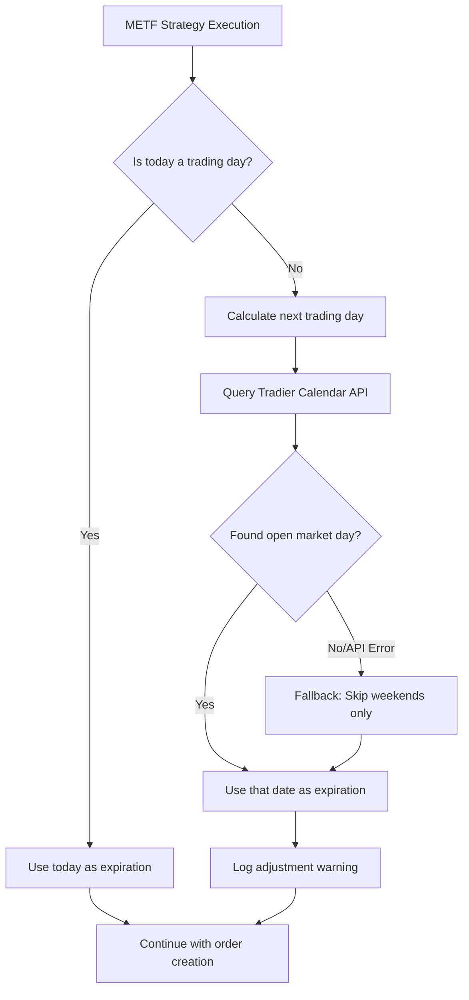

# Design Document: METF Trading Day Expiration

## Overview

This design implements automatic detection of non-trading days (weekends and US market holidays) and calculation of the next valid trading day for the METF 0DTE strategy. The solution leverages the **Tradier Market Calendar API** (`/v1/markets/calendar`) to get accurate, real-time market calendar data instead of maintaining a static holiday list.

## Architecture

The solution follows a modular approach with a new utility module for trading day calculations:

```
src/
├── utils/
│   └── trading_calendar.py    # NEW: Trading day utilities using Tradier API
├── strategy/
│   └── metf_strategy.py       # MODIFIED: Use trading calendar
├── bot/
│   └── trading_bot.py         # MODIFIED: Use trading calendar in process_metf_symbol
└── interactive.py             # MODIFIED: Use trading calendar for METF
```



## Components and Interfaces

### TradingCalendar Utility

A new utility class that provides trading day detection and calculation using the Tradier Market Calendar API:

```python
# src/utils/trading_calendar.py

from datetime import date, timedelta
from typing import Optional, Dict, List
import requests

class TradingCalendar:
    """Utility for trading day calculations using Tradier Market Calendar API.
    
    Uses the Tradier /v1/markets/calendar endpoint to get accurate market
    open/close status for any date, including holidays.
    """
    
    def __init__(
        self,
        api_token: str,
        is_sandbox: bool = False
    ):
        """Initialize with Tradier API credentials.
        
        Args:
            api_token: Tradier API access token
            is_sandbox: Whether to use sandbox API
        """
        
    def get_market_calendar(self, month: int, year: int) -> Dict:
        """Fetch market calendar for a given month from Tradier API.
        
        Endpoint: GET /v1/markets/calendar
        Params: month, year
        
        Returns:
            Dict with calendar data including open/close status for each day
        """
        
    def is_trading_day(self, check_date: date) -> bool:
        """Check if a date is a valid trading day using Tradier API.
        
        Queries the market calendar and checks the 'status' field.
        Falls back to weekend-only check if API unavailable.
        """
        
    def get_next_trading_day(self, from_date: date) -> date:
        """Get the next valid trading day from a given date.
        
        Uses Tradier calendar to find the next day with status='open'.
        """
        
    def get_0dte_expiration(self, execution_date: date = None) -> date:
        """Get the appropriate 0DTE expiration date.
        
        If execution_date is a trading day, returns execution_date.
        Otherwise, returns the next trading day.
        """


# Convenience function for use without broker client
def get_trading_calendar(
    api_token: str = None,
    is_sandbox: bool = False
) -> TradingCalendar:
    """Factory function to create TradingCalendar instance.
    
    If api_token not provided, attempts to read from environment.
    """
```

### Tradier Market Calendar API Response

The Tradier `/v1/markets/calendar` endpoint returns:

```json
{
  "calendar": {
    "month": 12,
    "year": 2025,
    "days": {
      "day": [
        {
          "date": "2025-12-25",
          "status": "closed",
          "description": "Christmas Day"
        },
        {
          "date": "2025-12-26",
          "status": "open",
          "open": {
            "start": "09:30",
            "end": "16:00"
          }
        }
      ]
    }
  }
}
```

### Integration Points

#### 1. trading_bot.py - process_metf_symbol()

```python
# Before (line ~2727):
expiration = date.today()

# After:
from src.utils.trading_calendar import TradingCalendar

# Create calendar using existing broker credentials
calendar = TradingCalendar(
    api_token=self.config.tradier_credentials.api_token,
    is_sandbox="sandbox" in self.config.tradier_credentials.base_url.lower()
)

expiration = calendar.get_0dte_expiration()
if expiration != date.today():
    self.logger.log_warning(
        f"Running on non-trading day, using next trading day for 0DTE",
        {"original_date": date.today().isoformat(), "expiration": expiration.isoformat()}
    )
```

#### 2. interactive.py - METF strategy section

```python
# Before (line ~2555):
expiration = date.today()

# After:
from src.utils.trading_calendar import TradingCalendar

# Get credentials from trading bot's config
calendar = TradingCalendar(
    api_token=trading_bot.config.tradier_credentials.api_token,
    is_sandbox="sandbox" in trading_bot.config.tradier_credentials.base_url.lower()
)

expiration = calendar.get_0dte_expiration()
if expiration != date.today():
    print(f"  ⚠️  Running on non-trading day ({date.today().strftime('%A')})")
    print(f"  📅 Using next trading day: {expiration.strftime('%A, %m/%d/%Y')}")
```

## Data Models

### Calendar Cache

To minimize API calls, the calendar data is cached per month:

```python
@dataclass
class CachedCalendar:
    """Cached calendar data for a month."""
    month: int
    year: int
    trading_days: set[date]  # Days with status='open'
    holidays: dict[date, str]  # date -> description
    fetched_at: datetime
    
    def is_stale(self, max_age_hours: int = 24) -> bool:
        """Check if cache is older than max_age_hours."""
```

### Fallback Static Holidays

In case the Tradier API is unavailable, a minimal static fallback is maintained:

```python
# Only used when API fails - covers major holidays
FALLBACK_HOLIDAYS = {
    # 2025
    date(2025, 1, 1),   # New Year's Day
    date(2025, 1, 20),  # MLK Day
    date(2025, 2, 17),  # Presidents' Day
    date(2025, 4, 18),  # Good Friday
    date(2025, 5, 26),  # Memorial Day
    date(2025, 6, 19),  # Juneteenth
    date(2025, 7, 4),   # Independence Day
    date(2025, 9, 1),   # Labor Day
    date(2025, 11, 27), # Thanksgiving
    date(2025, 12, 25), # Christmas
    # 2026 (add as needed)
}
```

## Error Handling

| Scenario | Handling |
|----------|----------|
| Tradier API unavailable | Fall back to weekend check + static holidays |
| API rate limit | Use cached data if available, else fallback |
| Invalid API response | Log warning, use fallback logic |
| Date far in future | Query API for that month, cache result |
| Invalid date input | Raise `ValueError` with descriptive message |
| Infinite loop protection | Limit search to 10 days ahead |

## Testing Strategy

### Unit Tests for TradingCalendar

1. **API Integration (mocked)**
   - Test parsing of Tradier calendar response
   - Test handling of closed days (holidays)
   - Test handling of open days

2. **Weekend Detection**
   - Test Saturday returns False for is_trading_day
   - Test Sunday returns False for is_trading_day
   - Test Monday-Friday returns True (when not holiday)

3. **Holiday Detection via API**
   - Mock API response with holiday
   - Verify is_trading_day returns False

4. **Next Trading Day Calculation**
   - Test Saturday → Monday
   - Test Sunday → Monday
   - Test Friday before holiday Monday → Tuesday
   - Test Thursday before Good Friday → Monday

5. **Fallback Behavior**
   - Test fallback when API returns error
   - Test fallback when API times out

6. **0DTE Expiration**
   - Test trading day returns same day
   - Test weekend returns next Monday
   - Test holiday returns next trading day

### Integration Tests

1. Test METF strategy execution on simulated weekend
2. Test METF strategy execution on simulated holiday
3. Verify logging output contains adjustment warnings
4. Test with real Tradier sandbox API (optional, for CI)
