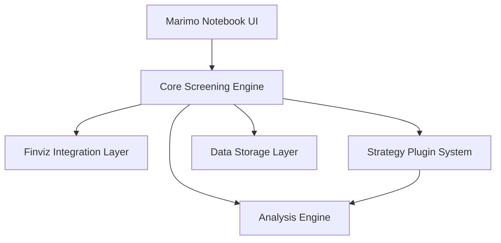

# Design Document

## Overview

This document describes the design for a strategy-specific stock screening system built with Marimo notebooks and Finviz Elite integration. The system provides an interactive interface for screening stocks based on options trading strategies (starting with put credit spreads), performing strategy-specific analysis, and managing screening results.

The architecture follows a modular, plugin-based design where new trading strategies can be added without modifying core components. The system leverages Marimo's reactive programming model for real-time UI updates and uses the finvizfinance Python library for Finviz Elite integration.

## Architecture

### High-Level Architecture



### Component Layers

1. **Presentation Layer**: Marimo notebook with reactive UI components
2. **Business Logic Layer**: Core screening engine and strategy plugins
3. **Data Access Layer**: Finviz integration and local storage
4. **Analysis Layer**: Strategy-specific calculations and metrics


## Components and Interfaces

### 1. Marimo Notebook Interface

**Purpose**: Provides interactive UI for stock screening and analysis

**Key Components**:
- `StrategySelector`: Dropdown for selecting trading strategy
- `FilterPanel`: Dynamic form for adjusting screening parameters
- `ResultsTable`: Sortable, filterable table displaying screened stocks
- `StockDetailView`: Detailed analysis view for individual stocks
- `ExportControls`: Buttons for exporting results to CSV/JSON

**Reactive State Management**:
```python
# Marimo cells are reactive - changes propagate automatically
strategy = mo.ui.dropdown(strategies, label="Strategy")
filters = mo.ui.dictionary({
    "min_market_cap": mo.ui.number(2_000_000_000),
    "min_volume": mo.ui.number(1_000_000),
    # ... other filters
})
results = screen_stocks(strategy.value, filters.value)
```

### 2. Core Screening Engine

**Purpose**: Orchestrates screening workflow and coordinates components

**Interface**:
```python
class ScreeningEngine:
    def screen_stocks(strategy_name: str, filters: dict) -> ScreenerResults
    def get_available_strategies() -> list[str]
    def load_strategy(strategy_name: str) -> StrategyModule
    def apply_filters(stocks: pd.DataFrame, filters: dict) -> pd.DataFrame
    def rank_results(stocks: pd.DataFrame, strategy: StrategyModule) -> pd.DataFrame
```


### 3. Finviz Integration Layer

**Purpose**: Handles authentication and data retrieval from Finviz Elite

**Library**: Uses `finvizfinance` Python library ([https://github.com/lit26/finvizfinance](https://github.com/lit26/finvizfinance))

**Interface**:
```python
class FinvizClient:
    def __init__(credentials: FinvizCredentials)
    def authenticate() -> bool
    def screen(filters: FinvizFilters) -> pd.DataFrame
    def get_stock_data(ticker: str) -> StockData
    def download_screener_results(url: str) -> pd.DataFrame
```

**Filter Mapping**:
The system translates internal filter representations to Finviz screener parameters:
```python
FINVIZ_FILTER_MAP = {
    "min_market_cap": "cap_midover",  # $2B+
    "min_volume": "sh_avgvol_o1000",  # Over 1M
    "price_min": "sh_price_o20",
    "price_max": "sh_price_u200",
    "rsi_min": "ta_rsi_os40",
    "rsi_max": "ta_rsi_ob70",
    # ... additional mappings
}
```

**Error Handling**:
- Retry logic with exponential backoff for network errors
- Rate limit detection and queuing
- Credential validation before requests


### 4. Strategy Plugin System

**Purpose**: Provides extensible architecture for adding new trading strategies

**Base Interface**:
```python
from abc import ABC, abstractmethod

class StrategyModule(ABC):
    @property
    @abstractmethod
    def name(self) -> str:
        """Strategy display name"""
        pass
    
    @property
    @abstractmethod
    def default_filters(self) -> dict:
        """Default screening parameters"""
        pass
    
    @abstractmethod
    def get_finviz_filters(self, params: dict) -> FinvizFilters:
        """Convert strategy params to Finviz filters"""
        pass
    
    @abstractmethod
    def score_stock(self, stock_data: StockData) -> float:
        """Calculate strategy-specific score (0-100)"""
        pass
    
    @abstractmethod
    def analyze_stock(self, stock_data: StockData) -> StrategyAnalysis:
        """Perform detailed strategy-specific analysis"""
        pass
```

**Plugin Discovery**:
Strategies are auto-discovered from the `strategies/` directory:
```python
def discover_strategies() -> dict[str, StrategyModule]:
    strategies = {}
    for file in Path("strategies").glob("*_strategy.py"):
        module = importlib.import_module(f"strategies.{file.stem}")
        if hasattr(module, "Strategy"):
            strategy = module.Strategy()
            strategies[strategy.name] = strategy
    return strategies
```


### 5. Put Credit Spread Strategy Implementation

**Purpose**: Implements PCS-specific screening and analysis

**Default Filters**:
```python
PCS_DEFAULT_FILTERS = {
    "min_market_cap": 2_000_000_000,  # $2B
    "min_volume": 1_000_000,
    "price_min": 20,
    "price_max": 200,
    "rsi_min": 40,
    "rsi_max": 70,
    "above_sma20": True,
    "above_sma50": True,
    "weekly_perf_min": -5,
    "weekly_perf_max": 10,
    "beta_min": 0.5,
    "beta_max": 1.5,
    "optionable": True,
    "shortable": True,
    "earnings_buffer_days": 14,
}
```

**Scoring Algorithm**:
```python
def score_stock(stock_data: StockData) -> float:
    score = 0
    
    # IV Rank (30 points)
    if stock_data.iv_rank > 50:
        score += 30 * (stock_data.iv_rank / 100)
    
    # Technical strength (25 points)
    if stock_data.price > stock_data.sma20:
        score += 10
    if stock_data.price > stock_data.sma50:
        score += 10
    if 45 <= stock_data.rsi <= 65:
        score += 5
    
    # Liquidity (20 points)
    volume_score = min(stock_data.avg_volume / 5_000_000, 1.0)
    score += 20 * volume_score
    
    # Stability (25 points)
    if 0.7 <= stock_data.beta <= 1.3:
        score += 15
    if stock_data.earnings_days_away > 14:
        score += 10
    
    return min(score, 100)
```


### 6. Analysis Engine

**Purpose**: Performs strategy-specific calculations and metrics

**Key Calculations**:

**Implied Volatility Rank (IV Rank)**:
```python
def calculate_iv_rank(current_iv: float, iv_history: pd.Series) -> float:
    """
    IV Rank = (Current IV - 52-week Low IV) / (52-week High IV - 52-week Low IV) * 100
    """
    iv_low = iv_history.min()
    iv_high = iv_history.max()
    if iv_high == iv_low:
        return 50.0
    return ((current_iv - iv_low) / (iv_high - iv_low)) * 100
```

**Support Level Identification**:
```python
def identify_support_levels(price_history: pd.DataFrame) -> list[float]:
    """
    Identifies key support levels using:
    1. Moving averages (20, 50, 200 day)
    2. Recent swing lows
    3. Psychological levels (round numbers)
    """
    supports = []
    
    # MA-based supports
    supports.append(price_history['sma20'].iloc[-1])
    supports.append(price_history['sma50'].iloc[-1])
    supports.append(price_history['sma200'].iloc[-1])
    
    # Swing lows (local minima in last 60 days)
    recent = price_history.tail(60)
    for i in range(5, len(recent) - 5):
        if recent['low'].iloc[i] == recent['low'].iloc[i-5:i+5].min():
            supports.append(recent['low'].iloc[i])
    
    # Psychological levels
    current_price = price_history['close'].iloc[-1]
    for level in range(0, int(current_price) + 20, 5):
        if abs(current_price - level) / current_price < 0.1:
            supports.append(float(level))
    
    return sorted(set(supports), reverse=True)
```


**Probability of Profit (POP) Estimation**:
```python
def estimate_pop_for_pcs(
    current_price: float,
    short_strike: float,
    days_to_expiration: int,
    implied_volatility: float
) -> float:
    """
    Estimates probability of profit using delta approximation.
    For PCS, POP ≈ 1 - |delta of short put|
    
    Uses simplified Black-Scholes delta calculation.
    """
    from scipy.stats import norm
    import numpy as np
    
    # Assume risk-free rate of 5%
    r = 0.05
    
    # Time in years
    T = days_to_expiration / 365.0
    
    # Calculate d1 for Black-Scholes
    d1 = (np.log(current_price / short_strike) + 
          (r + 0.5 * implied_volatility**2) * T) / \
         (implied_volatility * np.sqrt(T))
    
    # Delta for put option
    put_delta = norm.cdf(d1) - 1
    
    # POP is approximately 1 - |delta|
    pop = 1 - abs(put_delta)
    
    return pop * 100  # Return as percentage
```

**Premium Estimation**:
```python
def estimate_pcs_premium(
    current_price: float,
    short_strike: float,
    long_strike: float,
    days_to_expiration: int,
    implied_volatility: float
) -> dict:
    """
    Estimates premium for a put credit spread using Black-Scholes.
    """
    from scipy.stats import norm
    import numpy as np
    
    r = 0.05
    T = days_to_expiration / 365.0
    
    def black_scholes_put(S, K, T, r, sigma):
        d1 = (np.log(S / K) + (r + 0.5 * sigma**2) * T) / (sigma * np.sqrt(T))
        d2 = d1 - sigma * np.sqrt(T)
        put_price = K * np.exp(-r * T) * norm.cdf(-d2) - S * norm.cdf(-d1)
        return put_price
    
    short_put_value = black_scholes_put(current_price, short_strike, T, r, implied_volatility)
    long_put_value = black_scholes_put(current_price, long_strike, T, r, implied_volatility)
    
    credit = short_put_value - long_put_value
    max_risk = short_strike - long_strike - credit
    
    return {
        "credit": credit,
        "max_risk": max_risk,
        "return_on_risk": (credit / max_risk) * 100 if max_risk > 0 else 0
    }
```


### 7. Data Storage Layer

**Purpose**: Manages persistence of screening results and configuration

**Storage Structure**:
```
data/
├── screener_results/
│   ├── 2025-01-03_pcs_143022.json
│   ├── 2025-01-03_pcs_143022.csv
│   └── ...
├── screener_history.json
└── user_presets.json
```

**Interface**:
```python
class StorageManager:
    def save_results(results: ScreenerResults, strategy: str) -> str
    def load_results(result_id: str) -> ScreenerResults
    def get_history(limit: int = 50) -> list[ScreeningSession]
    def save_preset(name: str, strategy: str, filters: dict) -> None
    def load_preset(name: str) -> dict
    def list_presets(strategy: str = None) -> list[str]
    def export_to_csv(results: ScreenerResults, path: str) -> None
    def export_to_json(results: ScreenerResults, path: str) -> None
```

**Data Models**:
```python
@dataclass
class ScreenerResults:
    timestamp: datetime
    strategy: str
    filters: dict
    stocks: pd.DataFrame
    metadata: dict

@dataclass
class ScreeningSession:
    id: str
    timestamp: datetime
    strategy: str
    num_results: int
    filters_summary: str
```


### 8. Configuration Management

**Purpose**: Manages application and user configuration

**Configuration Files**:
```python
# config/screener_config.json
{
    "finviz": {
        "credentials_path": ".env",
        "rate_limit_delay": 1.0,
        "max_retries": 3
    },
    "storage": {
        "results_dir": "data/screener_results",
        "max_history_entries": 100
    },
    "analysis": {
        "risk_free_rate": 0.05,
        "default_dte": 45
    }
}

# config/strategies/{strategy_name}_config.json
{
    "name": "Put Credit Spread",
    "description": "Strategy description",
    "default_filters": {
        "min_market_cap": 2000000000,
        "min_volume": 1000000,
        // ... other filters
    },
    "scoring_weights": {
        "iv_rank": 30,
        "technical_strength": 25,
        // ... other weights
    },
    "analysis_settings": {
        "default_dte": 45,
        // ... other settings
    }
}
```

**Interface**:
```python
class ConfigManager:
    def load_config() -> dict
    def get(key_path: str, default: Any = None) -> Any
    def set(key_path: str, value: Any) -> None
    def save() -> None
    def validate() -> list[str]  # Returns validation errors
    
    # Preset management
    def save_preset(name: str, strategy: str, filters: dict) -> None
    def load_preset(name: str, strategy: str) -> Optional[dict]
    def list_presets(strategy: Optional[str] = None) -> list[str]
    
    # Strategy configuration (NEW)
    def load_strategy_config(strategy_name: str) -> Optional[dict]
    def get_strategy_defaults(strategy_name: str) -> dict
    def get_strategy_scoring_weights(strategy_name: str) -> dict
    def get_strategy_analysis_settings(strategy_name: str) -> dict
    def list_available_strategies() -> list[str]
```

**Strategy Configuration System**:

The system supports strategy-specific configuration files that allow customization without code changes:

- **Location**: `config/strategies/{strategy_name}_config.json`
- **Purpose**: Define default filters, scoring weights, and analysis settings per strategy
- **Benefits**: 
  - Strategies can be customized without modifying code
  - New strategies can be added by creating a config file
  - Strategy parameters are centralized and documented
  - Configs can be shared and version controlled

**Available Strategy Configs**:
- `pcs_config.json` - Put Credit Spread
- `covered_call_config.json` - Covered Call
- `iron_condor_config.json` - Iron Condor
- `collar_config.json` - Collar

## Data Models

### Stock Data Model
```python
@dataclass
class StockData:
    ticker: str
    company_name: str
    price: float
    volume: int
    avg_volume: int
    market_cap: float
    
    # Technical indicators
    rsi: float
    sma20: float
    sma50: float
    sma200: float
    beta: float
    
    # Options data
    implied_volatility: float
    iv_rank: float
    option_volume: int
    
    # Fundamental data
    sector: str
    industry: str
    earnings_date: Optional[date]
    earnings_days_away: int
    
    # Performance metrics
    perf_week: float
    perf_month: float
    perf_quarter: float
```


### Strategy Analysis Model
```python
@dataclass
class StrategyAnalysis:
    ticker: str
    strategy_score: float  # 0-100
    
    # PCS-specific fields
    support_levels: list[float]
    recommended_strikes: dict  # {"short": 95, "long": 90}
    estimated_premium: float
    probability_of_profit: float
    max_risk: float
    return_on_risk: float
    
    # Visualizations
    price_chart_data: dict
    iv_history_data: dict
    
    # Recommendations
    trade_recommendation: str  # "Strong Buy", "Buy", "Hold", "Avoid"
    risk_assessment: str
    notes: list[str]
```

## Correctness Properties

*A property is a characteristic or behavior that should hold true across all valid executions of a system—essentially, a formal statement about what the system should do. Properties serve as the bridge between human-readable specifications and machine-verifiable correctness guarantees.*


### Property 1: Reactive UI Updates
*For any* screening parameter modification in the Marimo notebook, the results display should update automatically without requiring manual refresh.
**Validates: Requirements 1.2**

### Property 2: Results Display Completeness
*For any* screening result set, the displayed table should contain stock symbols, key metrics (price, volume, market cap), and strategy-specific scores for all stocks.
**Validates: Requirements 1.3**

### Property 3: Stock Detail View Trigger
*For any* stock in the screening results, selecting that stock should trigger display of detailed analysis including support levels, probability of profit, and premium estimates.
**Validates: Requirements 1.4**

### Property 4: Preference Persistence Round-Trip
*For any* set of screening parameters, saving preferences then loading them should return equivalent parameter values.
**Validates: Requirements 1.5**

### Property 5: Authentication Success
*For any* valid Finviz Elite credential set, authentication should succeed and establish a connection.
**Validates: Requirements 2.1**

### Property 6: Filter Application Correctness
*For any* configured filter set, all stocks in the retrieved results should satisfy every filter criterion.
**Validates: Requirements 2.2**

### Property 7: Downloaded Data Completeness
*For any* Finviz result set, the downloaded data should include all required fields: price, volume, technical indicators (RSI, SMAs), and fundamental metrics (market cap, sector, earnings date).
**Validates: Requirements 2.3**

### Property 8: Data Parsing Validity
*For any* downloaded Finviz data, parsing should produce a valid DataFrame with correct data types for all columns.
**Validates: Requirements 2.4**


### Property 9: PCS Filter Criteria Enforcement
*For any* stock in PCS screening results, it should satisfy all PCS criteria: market cap > $2B, volume > 1M, price in [$20, $200], RSI in [40, 70], price above SMA20 and SMA50, weekly performance in [-5%, 10%], beta in [0.5, 1.5], optionable and shortable.
**Validates: Requirements 3.1, 3.2, 3.3, 3.4, 3.5, 3.6, 3.7, 3.8**

### Property 10: Earnings Date Filtering
*For any* stock in PCS screening results when earnings filtering is enabled, the earnings date should be more than 14 days away.
**Validates: Requirements 3.9**

### Property 11: Results Ranking Order
*For any* screening result set, stocks should be ordered by strategy-specific score in descending order (highest score first).
**Validates: Requirements 3.10**

### Property 12: Analysis Completeness
*For any* analyzed stock, the analysis result should include IV rank, support levels, probability of profit, and premium estimate.
**Validates: Requirements 4.1, 4.2, 4.3, 4.4**

### Property 13: Visualization Data Generation
*For any* completed analysis, the result should include chart data for price history with support levels and IV history.
**Validates: Requirements 4.5**

### Property 14: Comparative Metrics Availability
*For any* set of multiple analyzed stocks, comparative metrics (relative scores, rankings) should be available for all stocks.
**Validates: Requirements 4.6**

### Property 15: Strategy Plugin Discovery
*For any* valid strategy module file placed in the strategies directory, the system should automatically discover and register it.
**Validates: Requirements 5.2**

### Property 16: Strategy Loading Correctness
*For any* registered strategy, selecting it should load its specific default filters and analysis functions.
**Validates: Requirements 5.3**

### Property 17: Strategy Interface Validation
*For any* loaded strategy module, it should implement all required interface methods (get_finviz_filters, score_stock, analyze_stock).
**Validates: Requirements 5.5**


### Property 18: Results Persistence
*For any* completed screening operation, the results should be saved to local storage with a timestamp.
**Validates: Requirements 6.1**

### Property 19: Historical Results Retrieval
*For any* saved screening session, requesting it by ID should return the complete saved results.
**Validates: Requirements 6.2**

### Property 20: Export Round-Trip Consistency
*For any* screening result set, exporting to JSON then importing should produce equivalent data.
**Validates: Requirements 6.4**

### Property 21: CSV Export Completeness
*For any* screening result set, the exported CSV should contain all stock data columns and analysis metrics.
**Validates: Requirements 6.3**

### Property 22: History Log Maintenance
*For any* screening operation, an entry should be added to the history log containing timestamp, strategy name, filter parameters, and result count.
**Validates: Requirements 6.5**

### Property 23: Preset Round-Trip Consistency
*For any* parameter configuration, saving as a named preset then loading that preset should return equivalent parameters.
**Validates: Requirements 7.2, 7.3**

### Property 24: Multiple Presets Per Strategy
*For any* strategy, multiple distinct presets should be storable and independently retrievable without interference.
**Validates: Requirements 7.4**

### Property 25: Parameter Range Validation
*For any* numeric parameter, values outside the valid range should be rejected with a clear error message.
**Validates: Requirements 7.6, 8.3**

## Error Handling

The system implements comprehensive error handling across all components:

### Authentication Errors
- Invalid credentials: Display specific error message with credential verification prompt
- Network timeouts: Retry with exponential backoff (1s, 2s, 4s, 8s)
- Rate limits: Display time until reset and queue request

### Data Errors
- Missing required fields: Log warning and use safe defaults
- Invalid data types: Skip malformed records and log errors
- Empty result sets: Suggest relaxing specific filters

### Storage Errors
- Write failures: Retry once, then notify user
- Read failures: Attempt recovery from backup, fallback to empty state
- Disk space issues: Alert user and suggest cleanup

### Configuration Errors
- Invalid config files: Use safe defaults and log warnings
- Missing config: Generate default configuration
- Invalid parameter ranges: Reject with specific error message


## Testing Strategy

### Dual Testing Approach

The system will use both unit testing and property-based testing to ensure comprehensive coverage:

**Unit Tests**: Verify specific examples, edge cases, and error conditions
- Test authentication with known valid/invalid credentials
- Test empty result set handling
- Test rate limit error handling
- Test configuration file parsing with malformed JSON
- Test UI component rendering with specific data
- Test that minimum required strategies (PCS, Covered Call, Iron Condor, Collar) are available

**Property-Based Tests**: Verify universal properties across all inputs
- Test filter application with randomly generated stock data
- Test round-trip consistency for preferences, presets, and exports
- Test data completeness with various Finviz response formats
- Test ranking order with random score distributions
- Test parameter validation with random out-of-range values

### Property-Based Testing Configuration

**Library**: Use `hypothesis` for Python property-based testing

**Test Configuration**:
- Minimum 100 iterations per property test
- Each test tagged with format: **Feature: strategy-stock-screener, Property N: [property text]**
- Custom generators for domain-specific data (stock data, filter configurations, etc.)

**Example Test Structure**:
```python
from hypothesis import given, strategies as st
import hypothesis

@hypothesis.settings(max_examples=100)
@given(
    filters=st.fixed_dictionaries({
        'min_market_cap': st.floats(min_value=0, max_value=1e12),
        'min_volume': st.integers(min_value=0, max_value=1e9),
        # ... other filters
    }),
    stocks=st.lists(st.builds(StockData, ...))
)
def test_filter_application(filters, stocks):
    """
    Feature: strategy-stock-screener, Property 9: PCS Filter Criteria Enforcement
    
    For any stock in PCS screening results, it should satisfy all PCS criteria.
    """
    results = apply_pcs_filters(stocks, filters)
    for stock in results:
        assert stock.market_cap > filters['min_market_cap']
        assert stock.avg_volume > filters['min_volume']
        # ... other assertions
```

### Integration Testing

**Finviz Integration Tests**:
- Use test credentials in isolated environment
- Mock Finviz API responses for consistent testing
- Test rate limiting behavior with controlled request patterns

**Marimo Notebook Tests**:
- Test reactive updates with simulated user interactions
- Verify UI component state management
- Test notebook execution from command line

### Test Coverage Goals

- Core screening engine: 90%+ coverage
- Strategy modules: 85%+ coverage
- Analysis engine: 90%+ coverage
- Storage layer: 80%+ coverage
- Error handling paths: 100% coverage

