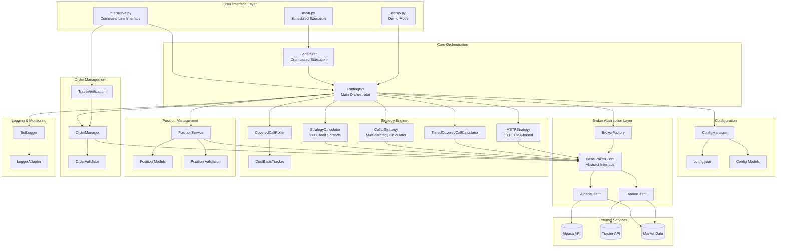
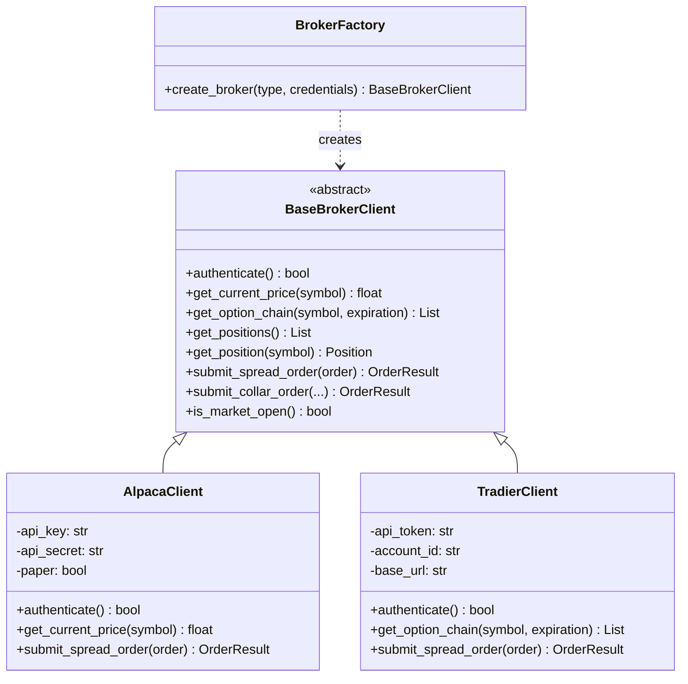
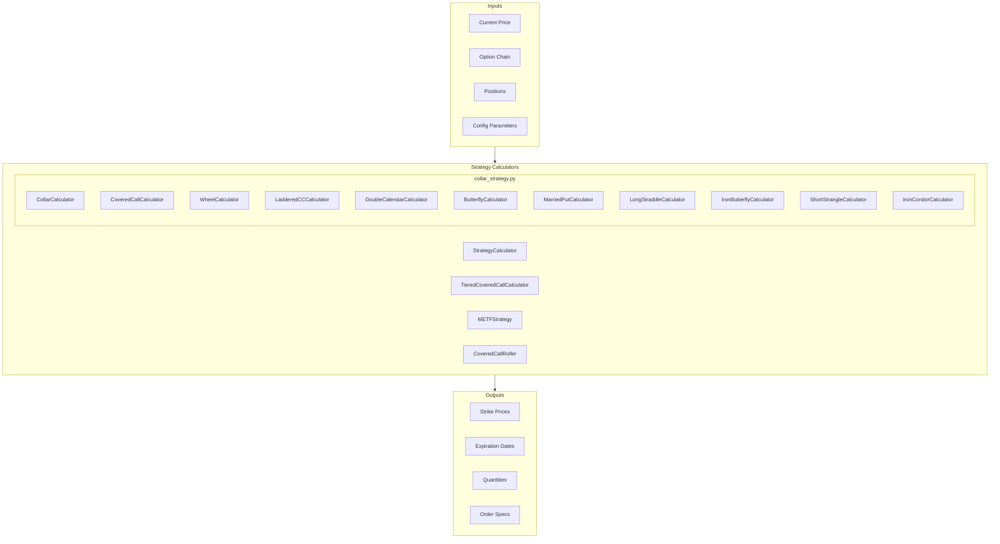
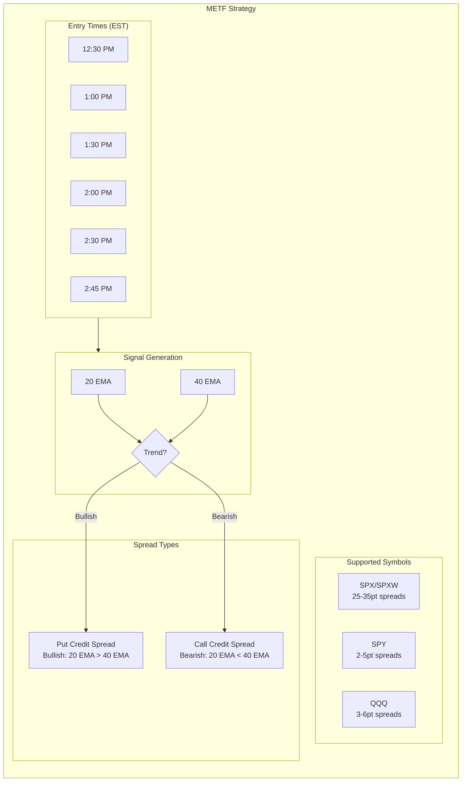
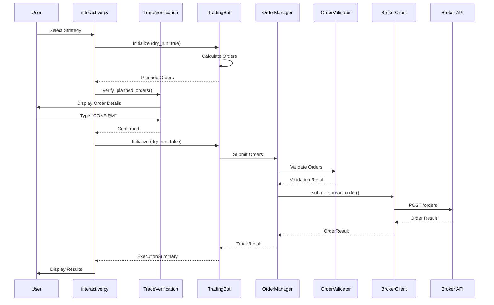
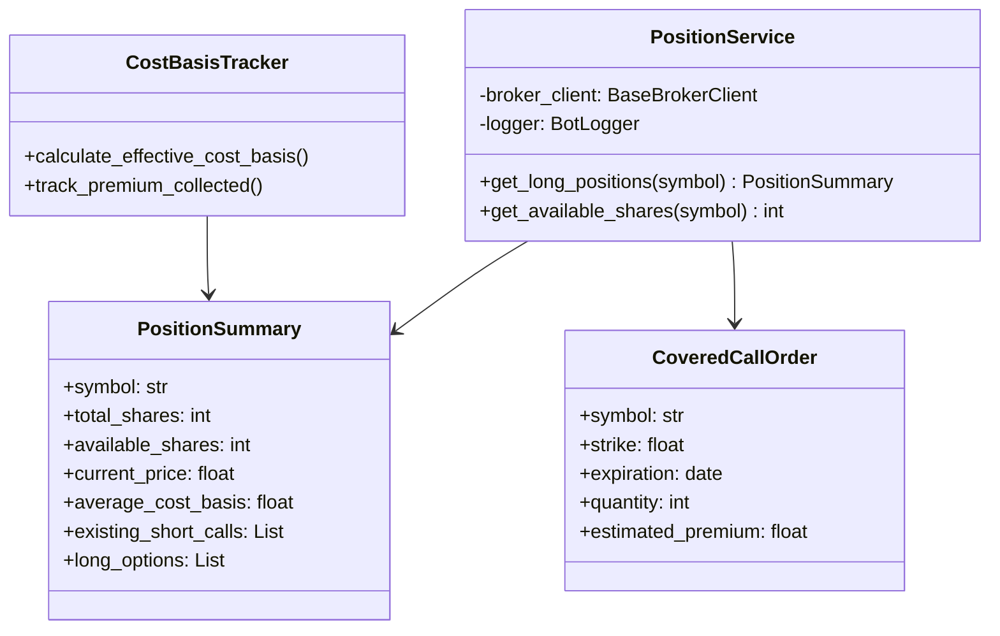
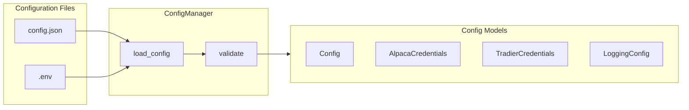
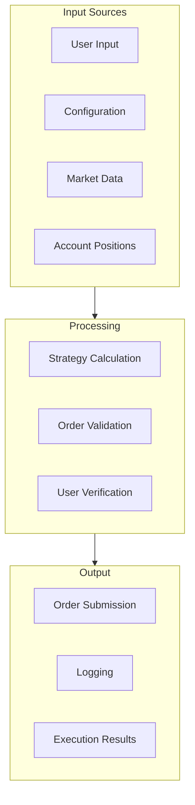

# Options Trading Bot - Architecture

## System Overview

This document provides a comprehensive view of the Options Trading Bot architecture, including all components, their relationships, and data flows.

## High-Level Architecture



## Component Details

### 1. User Interface Layer

```mermaid
flowchart LR
    subgraph Interactive["interactive.py"]
        BANNER[Display Banner]
        SELECT[Symbol Selection]
        STRAT[Strategy Selection]
        VERIFY[Trade Verification]
        EXEC[Execute Trade]
    end

    BANNER --> SELECT --> STRAT --> VERIFY --> EXEC

    subgraph Strategies["Available Strategies"]
        PCS[Put Credit Spread]
        CC[Covered Call]
        WS[Wheel Strategy]
        PC[Protected Collar]
        TCC[Tiered CC]
        METF[METF 0DTE]
        IC[Iron Condor]
        IB[Iron Butterfly]
        LS[Long Straddle]
        SS[Short Strangle]
        JL[Jade Lizard]
        BL[Big Lizard]
        DC[Double Calendar]
        BF[Butterfly]
        BWB[Broken Wing BF]
        MP[Married Put]
        LCC[Laddered CC]
    end

    STRAT --> Strategies
```



### 2. Broker Abstraction Layer



### 3. Strategy Engine



### 4. METF Strategy (0DTE)



### 5. Order Flow



### 6. Position Management



### 7. Configuration



## Data Flow Summary



## Technology Stack

| Component | Technology |
|-----------|------------|
| Language | Python 3.11+ |
| Broker Integration | Alpaca API, Tradier API |
| Configuration | JSON, Environment Variables |
| Logging | Python logging, Custom BotLogger |
| Testing | pytest |
| CI/CD | GitHub Actions |

## File Structure

```
lumibot-trading-bot/
├── interactive.py          # Main CLI interface
├── main.py                 # Scheduled execution entry
├── demo.py                 # Demo/simulation mode
├── config/
│   └── config.json         # Trading configuration
├── src/
│   ├── bot/
│   │   └── trading_bot.py  # Main orchestrator
│   ├── brokers/
│   │   ├── base_client.py  # Abstract broker interface
│   │   ├── alpaca_client.py
│   │   ├── tradier_client.py
│   │   └── broker_factory.py
│   ├── strategy/
│   │   ├── strategy_calculator.py
│   │   ├── collar_strategy.py
│   │   ├── tiered_covered_call_strategy.py
│   │   ├── metf_strategy.py
│   │   ├── covered_call_roller.py
│   │   └── cost_basis_tracker.py
│   ├── positions/
│   │   ├── position_service.py
│   │   ├── models.py
│   │   └── validation.py
│   ├── order/
│   │   ├── order_manager.py
│   │   └── order_validator.py
│   ├── config/
│   │   ├── config_manager.py
│   │   └── models.py
│   ├── logging/
│   │   ├── bot_logger.py
│   │   └── logger_adapter.py
│   └── scheduler/
│       └── scheduler.py
├── tests/                  # Test suite
├── logs/                   # Log files
└── docs/                   # Documentati